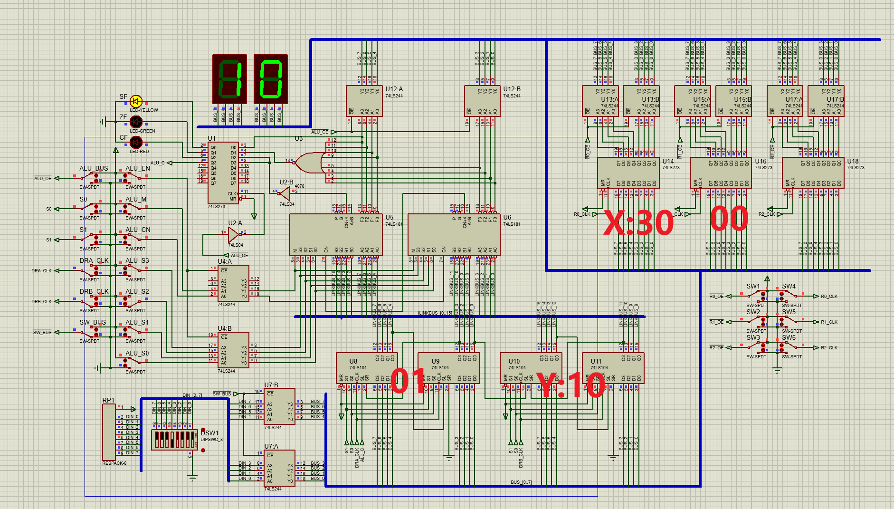
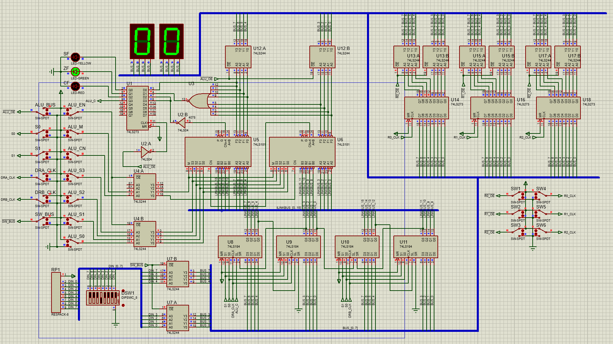
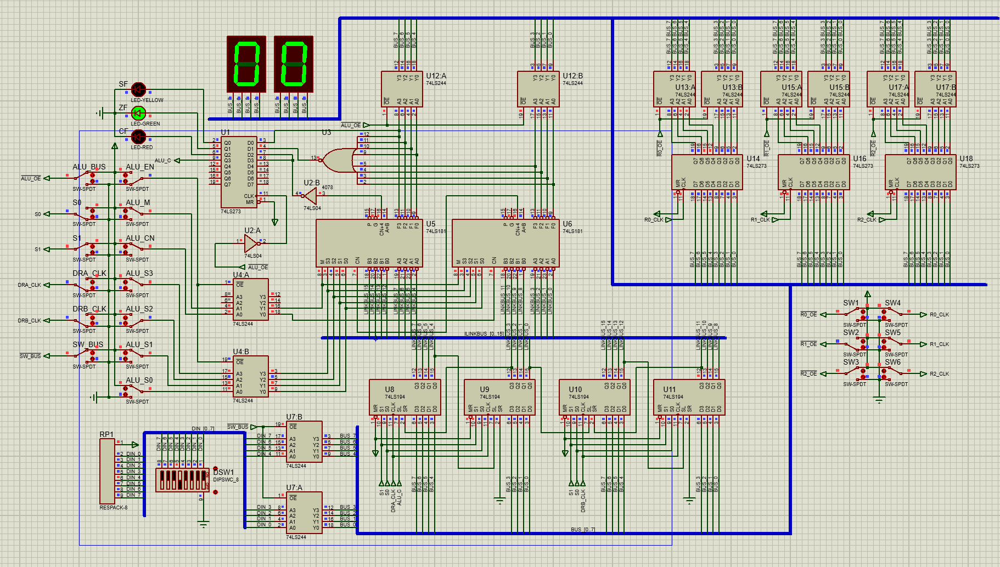
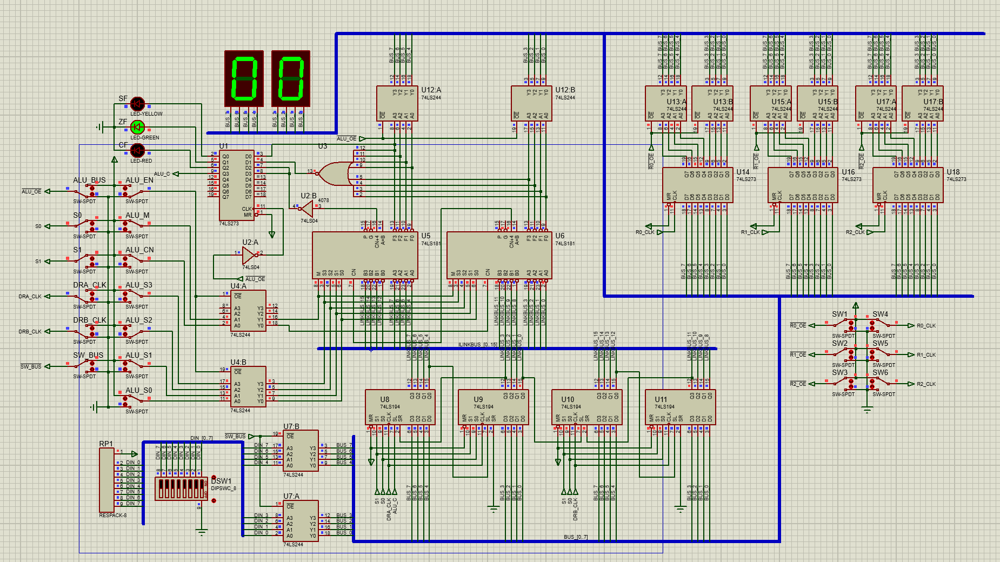
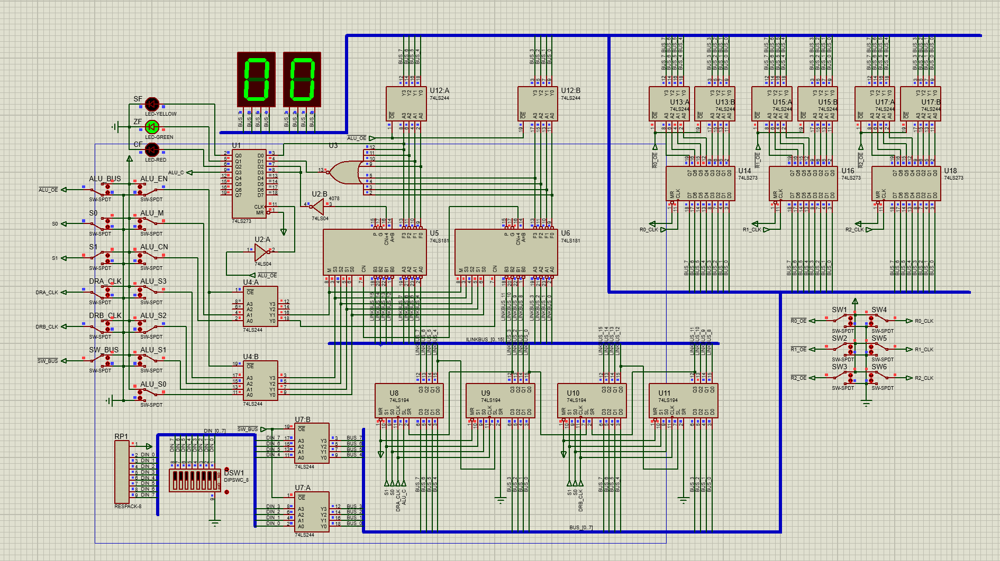
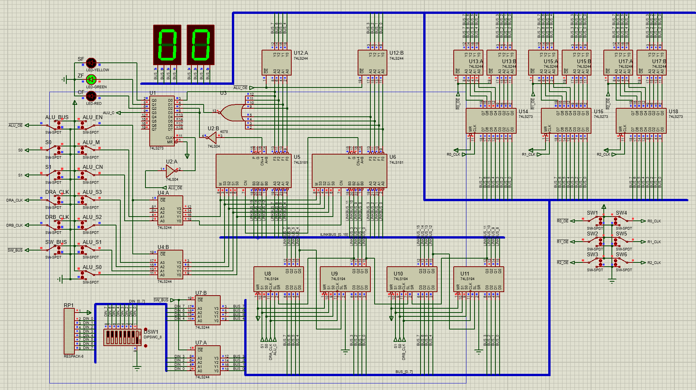
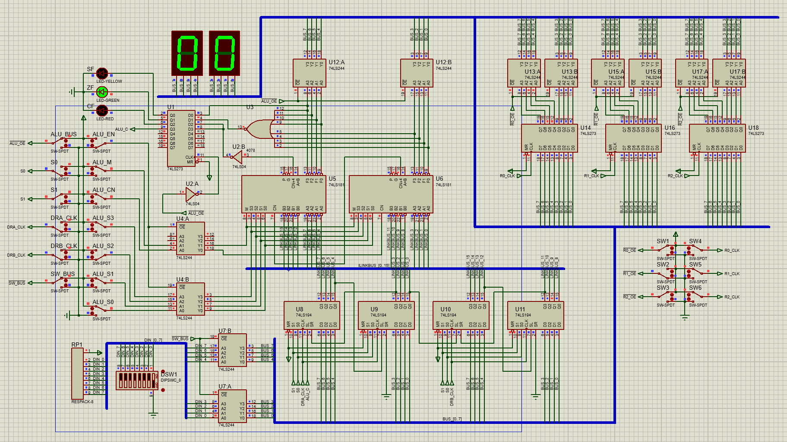
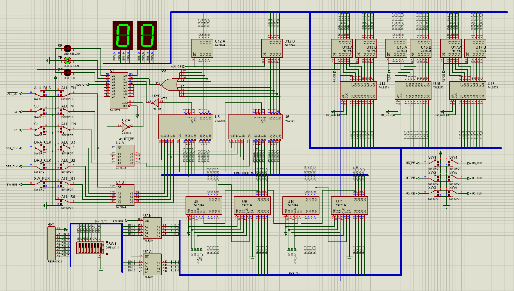
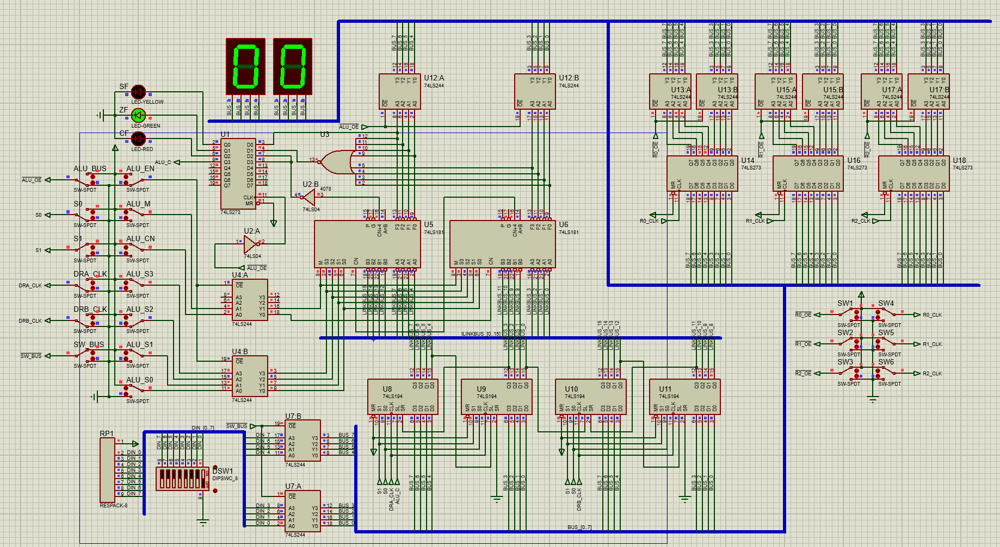

## 参考资料
[【计算机组成原理】二进制数的乘法运算\_哔哩哔哩\_bilibili](https://www.bilibili.com/video/BV1J94y1w7T5/?spm_id_from=333.337.search-card.all.click&vd_source=0ca07f837bf8ee7607324d7927199dcc)
实验3 串行乘法运算实验

### 1\. 初始值确认（16进制）

  * **被乘数 X (REG\_0)**: $30_{(16)}$
      * 二进制: `0011 0000`
  * **乘数 Y (DRB)**: $10_{(16)}$
      * 二进制: `0001 0000` (注意这里！只有第5位是1，其他全是0)
  * **预期结果**: $30_{(16)} \times 10_{(16)} = 300_{(16)}$
      * 这就像十进制里 $30 \times 10 = 300$ 一样，16进制里 $30 \times 10$ 也是 $300$。

### 2\. 修正后的实验步骤表

**关键逻辑更新：**

  * $Y=10$ (`0001 0000`) 的最低位（第1位）是0。
  * 它右移4次后，那个 **1** 才会移动到最低位（Qn=1），触发加法。
  * 所以会在 **第5步** 进行加法，其余步骤全是移位。

| 步骤          | DRA (高位/部分积) | DRB (低位/乘数) | REG\_0 (被乘数 X) | REG\_1 (累加器) | REG\_2 (备份 Y) | Qn (判断位) | 截图                                         |
| :---------- | :-------------- | :------------- | :---------------- | :-------------- | :--------------- | :---------- | ------------------------------------------ |
| **设置初值**    | **01** (掩码)     | **10**         | **30**            | **00**          | **00**           | **0**       |  |
| **01** (判断) | 01              | 10             | 30                | 00              | 00               | **0**       |  |
| 移位结果        | **00**          | **08**         | 30                | 00              | 00               | -           |  |
| **02** (判断) | 01              | 08             | 30                | 00              | 00               | **0**       |  |
| 移位结果        | **00**          | **04**         | 30                | 00              | 00               | -           |  |
| **03** (判断) | 01              | 04             | 30                | 00              | 00               | **0**       |  |
| 移位结果        | **00**          | **02**         | 30                | 00              | 00               | -           |  |
| **04** (判断) | 01              | 02             | 30                | 00              | 00               | **0**       |  |
| 移位结果        | **00**          | **01**         | 30                | 00              | 00               | -           |  |
| **05** (判断) | **30** (加法后)    | 01             | 30                | **30**          | **01**           | **1**       |                                            |
| 移位结果        | **18**          | **00**         | 30                | **18**          | 01               | -           |                                            |
| **06** (判断) | 18              | 00             | 30                | 18              | 01               | **0**       |                                            |
| 移位结果        | **0C**          | **00**         | 30                | **0C**          | 01               | -           |                                            |
| **07** (判断) | 0C              | 00             | 30                | 0C              | 01               | **0**       |                                            |
| 移位结果        | **06**          | **00**         | 30                | **06**          | 01               | -           |                                            |
| **08** (判断) | 06              | 00             | 30                | 06              | 01               | **0**       |                                            |
| 移位结果        | **03**          | **00**         | 30                | **03**          | 01               | -           |                                            |
0000 0011 0000 0000
-----

### 重点步骤解释（第5步发生了什么？）

1.  **判断 Qn=1**：
      * 在第5步开始时，DRB 已经被移位成了 `01` (`0000 0001`)。
      * 最低位是 **1**，所以 **Qn=1**，触发加法逻辑。
2.  **执行加法**：
      * 部分积 (REG\_1) `00` + 被乘数 (REG\_0) `30` = `30`。
      * 结果 `30` 存入 DRA 和 REG\_1。
3.  **执行移位**：
      * **DRA (`30`) 右移**：
          * `30` (hex) = `0011 0000` (bin)。
          * 右移一位变成 `0001 1000` = **18** (hex)。
          * **注意**：`30` 的最低位是 **0**，所以移出的位是 **0**。
      * **DRB (`01`) 右移**：
          * DRB 接收来自 DRA 移出的那个位（也就是 0）。
          * 所以 `01` 右移并补入0 $\rightarrow$ **00**。
4.  **后续步骤**：
      * 之后 DRB 已经是 `00` 了，所有 Qn 都是 0，只是一直把高位的 `18` 往右移：
      * `18` $\rightarrow$ `0C` $\rightarrow$ `06` $\rightarrow$ **03**。

### 最终结果验证

  * **DRA (高8位)**: `03`
  * **DRB (低8位)**: `00`
  * **拼接结果**: `0300` (16进制)
  * **符合预期**: $30_{16} \times 10_{16} = 300_{16}$。
## 一些问题
### 为什么要重置DRA为1?
DRA是多功能寄存器,在中间被"污染"了

| 原因                | 解释                 |
| ----------------- | ------------------ |
| **1. DRA是多功能寄存器** | 既用来判断Qn,又用来存储加法结果  |
| **2. 判断需要固定模式**   | 必须用"DRB & 1"来提取最低位 |
| **3. 每轮循环要独立**    | 上一轮的计算结果不能影响下一轮的判断 |